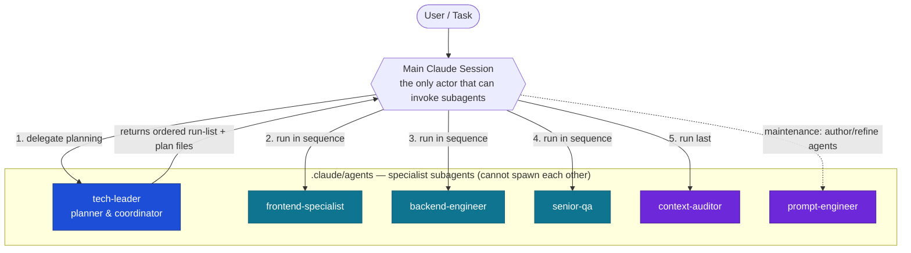
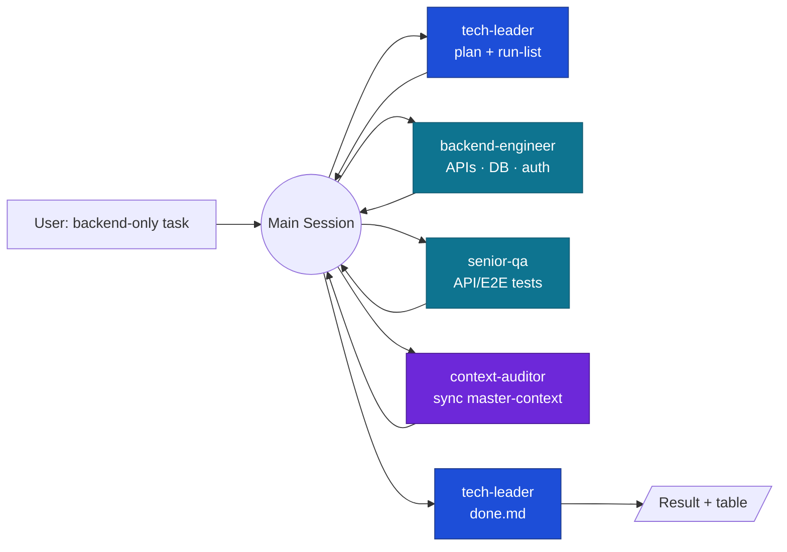
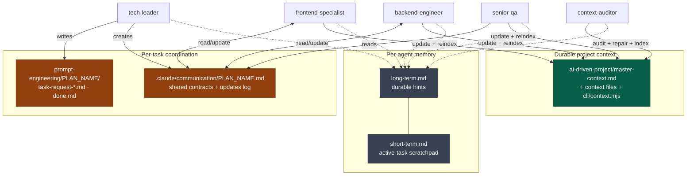
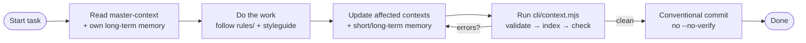

# AI Dream Team — Agents Architecture

This document describes the multi-agent system defined in `.claude/agents/` for the **RFEC** website
(single-page Next.js 16 · React 19 · TypeScript · Tailwind v4 · shadcn/ui · `pt-BR`). It explains each
agent, how they are coordinated, and the data they share, with Mermaid diagrams of the workflows.

> **Generated by:** a prompt-engineering pass (the `prompt-engineer` agent definition is itself part of
> the team). All agents share one north star: **read `ai-driven-project/master-context.md` before working
> and keep it (plus their memory) up to date after.**

---

## 1. The key architectural decision: orchestration lives in the main session

Claude Code has a hard platform rule: **a subagent cannot spawn another subagent.** The original Dream
Team design has the *Tech Leader* "calling" the Frontend/Backend/QA agents — that is impossible as a
literal subagent-calls-subagent chain.

So the architecture is **main-session-orchestrated**:

- The **main Claude session** is the conductor. It is the only actor that can invoke subagents.
- The **Tech Leader** is the *planner/coordinator*: it analyzes the task, writes high-level plan files,
  sets up the shared communication file, and returns an **ordered run-list** ("run frontend, then QA, …").
- The main session reads that run-list and **chains the specialists** one after another, feeding each the
  relevant plan file and the communication file.
- Agents never talk to each other directly — they coordinate **through files**
  (`prompt-engineering/<PLAN_NAME>/*.md`, `.claude/communication/<PLAN_NAME>.md`, and `master-context.md`).



---

## 2. The roster

| Agent | Role | Model | Tools | Reads (rules) | Memory dir |
| --- | --- | --- | --- | --- | --- |
| **tech-leader** | Plans, scopes, coordinates, writes `done.md`. No code. | `inherit` | Read, Write, Edit, Grep, Glob, Bash, TodoWrite | `rules/general-rules.md` | `.claude/memory/tech-leader/` |
| **frontend-specialist** | Builds React/Next UI; mock-data-first → API integration. | `inherit` | Read, Write, Edit, Grep, Glob, Bash | `rules/frontend-rules.md` + `design-styleguide/master-styleguide.md` | `.claude/memory/frontend-specialist/` |
| **backend-engineer** | APIs, DB, auth, integrations, infra. Reports back if no backend surface. | `inherit` | Read, Write, Edit, Grep, Glob, Bash | `rules/backend-rules.md` | `.claude/memory/backend-engineer/` |
| **senior-qa** | E2E tests (Playwright/Cypress) simulating user flows; bug reports. | `sonnet` | Read, Write, Edit, Grep, Glob, Bash (+ Playwright MCP) | `rules/qa-rules.md` | `.claude/memory/senior-qa/` |
| **context-auditor** | Keeps `master-context.md` accurate & indexed via the context CLI. | `sonnet` | Read, Write, Edit, Grep, Glob, Bash | `master-context.md` §4/§5 | `.claude/memory/context-auditor/` |
| **prompt-engineer** | Authors/refines agent definitions. Maintenance, not task flow. | `inherit` | Read, Write, Edit, Grep, Glob | `external-docs/claude/creating-agents.md` | _(stateless)_ |

*All paths under `ai-driven-project/` unless noted. Models can be downgraded for cost; `inherit` follows the main session's model.*

---

## 3. Full-stack workflow

The canonical flow for a task that touches UI and backend. Note every step is mediated by the main session.

```mermaid
sequenceDiagram
    actor U as User
    participant M as Main Session
    participant TL as tech-leader
    participant FE as frontend-specialist
    participant BE as backend-engineer
    participant QA as senior-qa
    participant CA as context-auditor
    participant FS as Shared Files<br/>(plans · communication · master-context)

    U->>M: Full-stack task
    M->>TL: Delegate planning
    TL->>FS: Read master-context; write plan files + communication file
    TL-->>M: Ordered run-list (FE → BE → QA → CA)

    M->>FE: Run with task-request-frontend.md
    FE->>FS: Read plan + styleguide; build UI (mock data); update communication
    FE-->>M: UI preview + summary
    M->>U: Show UI for review
    U-->>M: Feedback
    M->>FE: Apply feedback (iterate)
    FE-->>M: Updated UI

    M->>BE: Run with task-request-backend.md
    BE->>FS: Build APIs/migrations; record integration contract in communication
    BE-->>M: APIs + summary

    M->>FE: Integrate real APIs
    FE->>FS: Wire UI to API per contract
    FE-->>M: Integrated UI

    M->>QA: Run after implementation
    QA->>FS: Read plans + communication; write & run E2E tests
    QA-->>M: Test report + bugs

    M->>CA: Run last
    CA->>FS: Update affected contexts; run validate → index → check
    CA-->>M: Clean context index

    M->>TL: Specialists done
    TL->>FS: Write done.md (summary + table)
    TL-->>M: Final summary
    M->>U: Deliver result
```

---

## 4. Backend-only workflow

For tasks like "create a DB connection" or "add an endpoint", the Tech Leader omits the frontend leg —
only Backend + QA are involved, then the Context Auditor.



> **This repo today is frontend-only.** If a "backend" task has no real backend surface, the
> `backend-engineer` reports that back to the main session instead of inventing one.

---

## 5. Shared state: how agents coordinate without talking

Agents are isolated (separate context windows) and cannot call each other. All coordination is **file-based**,
across three distinct layers with different lifetimes:



| Layer | Where | Lifetime | Purpose |
| --- | --- | --- | --- |
| **Project context** | `ai-driven-project/master-context.md` (+ contexts, CLI) | Permanent | The map of the codebase; every agent reads it first and updates it after. |
| **Task coordination** | `ai-driven-project/prompt-engineering/<PLAN_NAME>/` and `.claude/communication/<PLAN_NAME>.md` | Per task | High-level plans, shared interface contracts, cross-agent updates log. |
| **Agent memory** | `.claude/memory/<agent>/{long,short}-term.md` | Long / per-task | Private hints an agent accumulates for itself. |

---

## 6. The context loop (definition of done for every agent)



Every agent's "Definition of done" ends with: **context updated & reindexed + memory updated**. The
`context-auditor` is the safety net that runs last and guarantees the index is clean even if an upstream
agent forgot.

---

## 7. Directory map

```
.claude/
├── agents/                      # the 6 agent definitions
│   ├── tech-leader.md
│   ├── frontend-specialist.md
│   ├── backend-engineer.md
│   ├── senior-qa.md
│   ├── context-auditor.md
│   └── prompt-engineer.md
├── communication/               # per-task shared files (README explains format)
└── memory/<agent>/              # long-term.md + short-term.md per agent

ai-driven-project/
├── master-context.md            # context index + CLI-driven registry
├── core|features|infrastructure|utilities/   # context files
├── cli/context.mjs              # validate | index | check | search | list
├── rules/                       # general | frontend | backend | qa rules
├── design-styleguide/master-styleguide.md
├── prompt-engineering/<PLAN_NAME>/   # plan files + done.md
└── external-docs/claude/creating-agents.md
```

---

## 8. How to run the team (from the main session)

1. **Kick off:** "Use the **tech-leader** agent to plan `<task>`." It writes the plan folder + communication
   file and returns an ordered run-list.
2. **Execute the run-list in order**, e.g. "Use the **frontend-specialist** with
   `prompt-engineering/<PLAN_NAME>/task-request-frontend.md`." Iterate with the user on UI.
3. Continue down the list (**backend-engineer** → integration → **senior-qa**).
4. **Audit:** "Use the **context-auditor** to sync the context system." It runs `validate → index → check`.
5. **Close:** ask **tech-leader** to write `done.md`.
6. **Maintenance:** when you need a new/edited agent, "Use the **prompt-engineer** agent."

> **Activation note:** newly added files in `.claude/agents/` load at session start. After creating these,
> **restart Claude Code (or run `/agents`)** so they become invocable as `subagent_type`.
